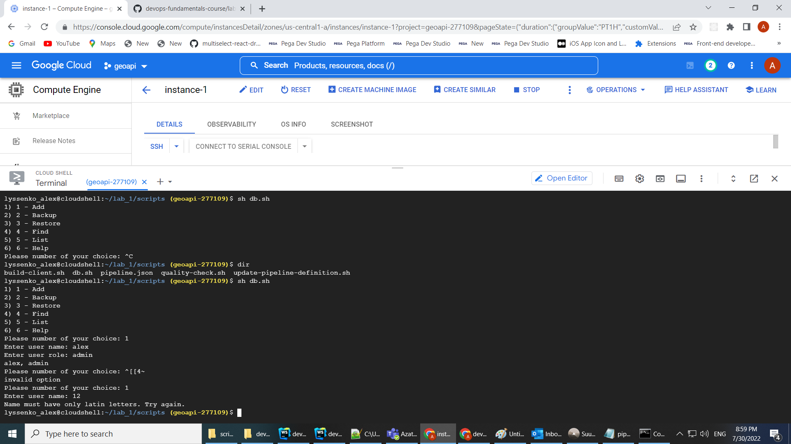
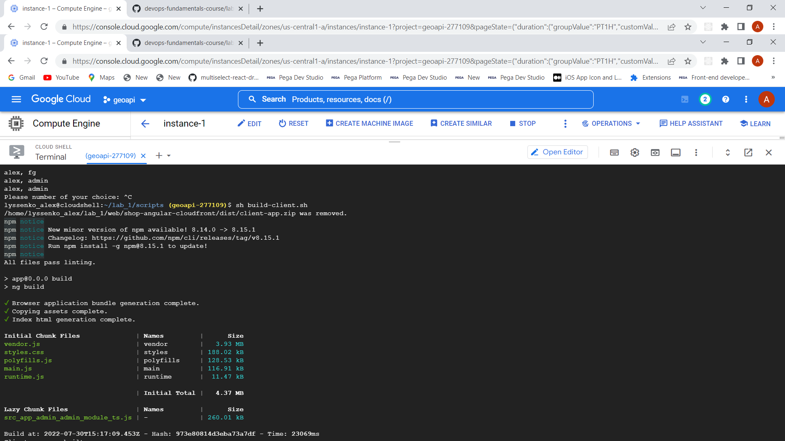
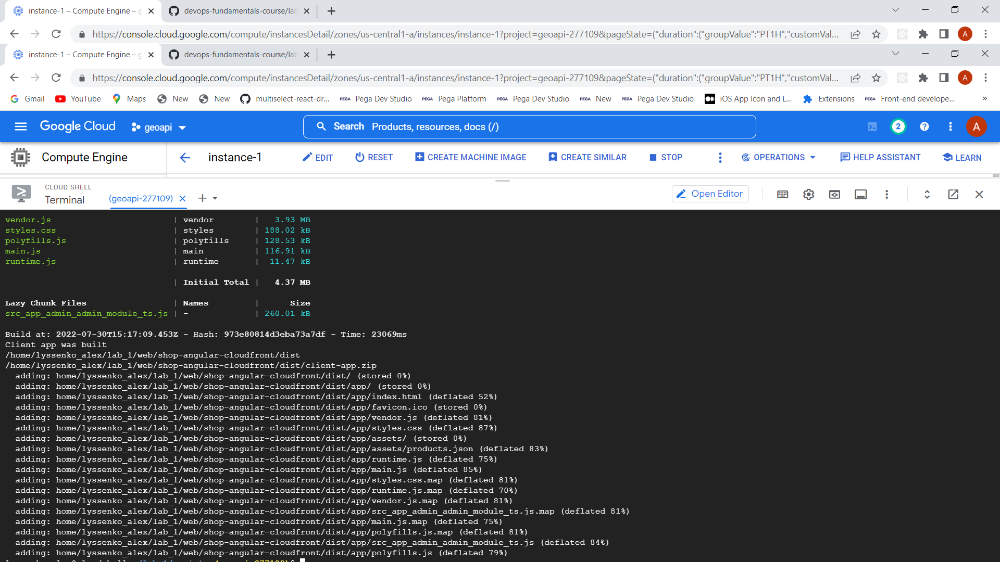
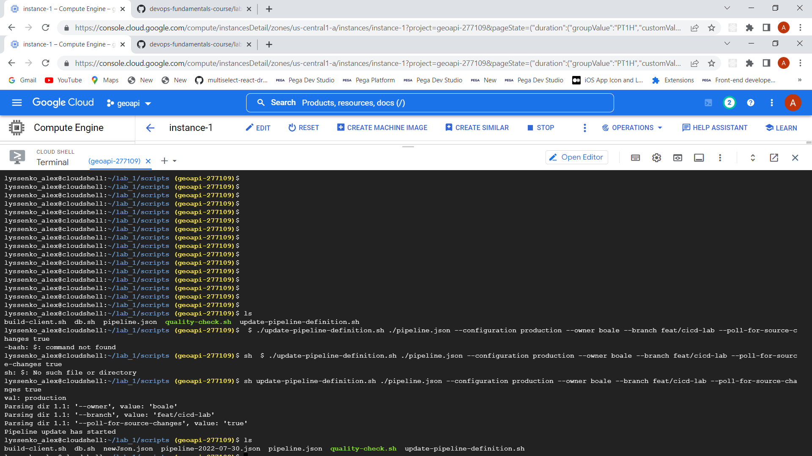
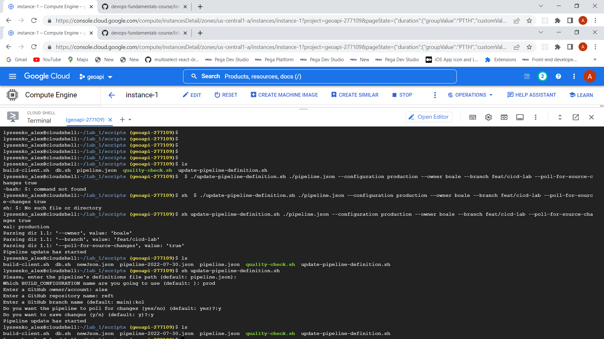

## Part 2. Create a Bash script using Vim
### Add user

### List user  

### Find user

### Backup restore

---

## Part 3. Automate the build process with Bash
build and zip

## Part 4. Automate tasks with JSON files
### With params

### With no params

